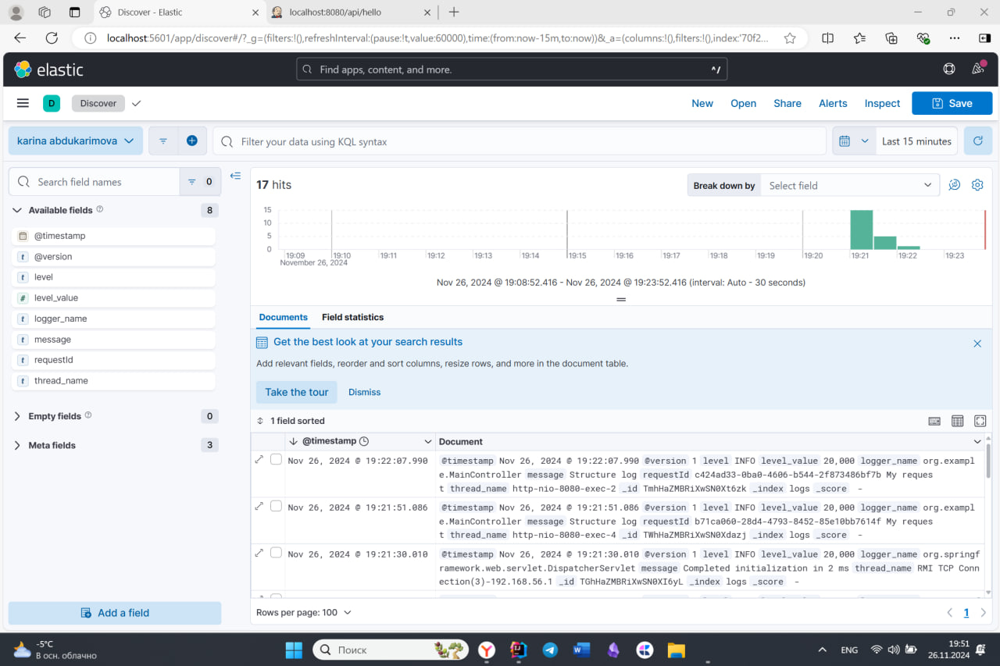
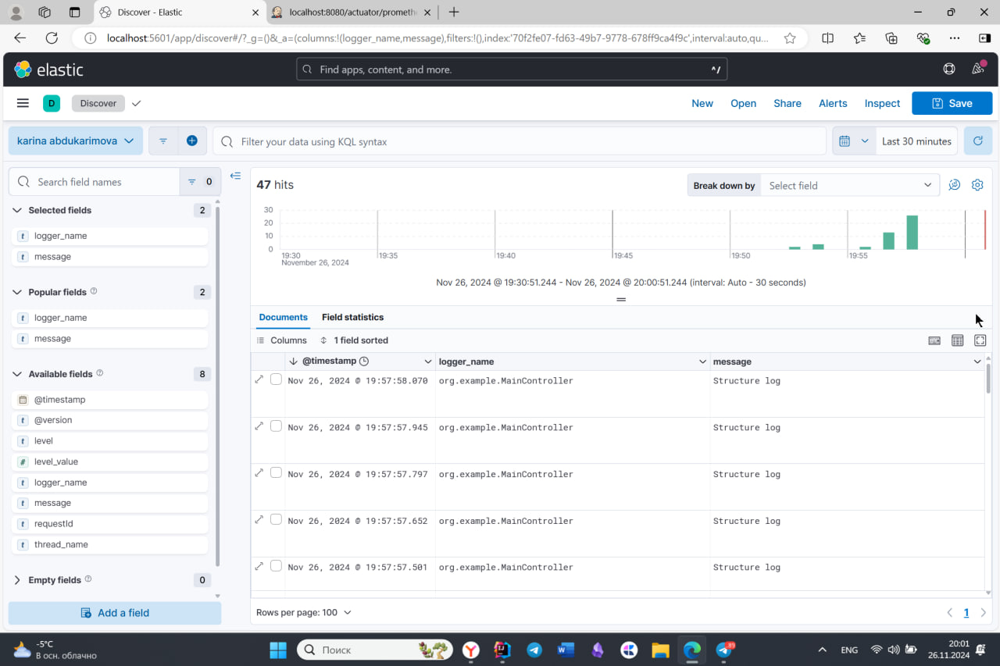
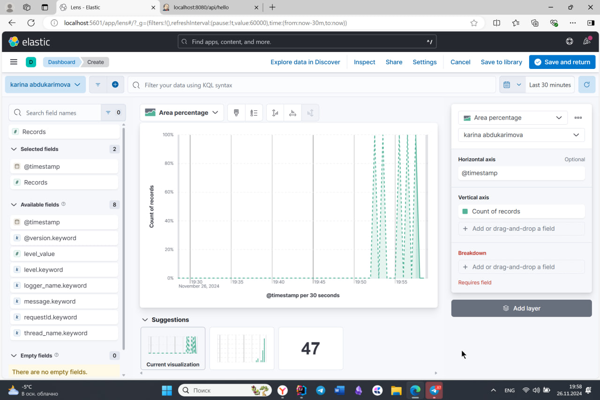
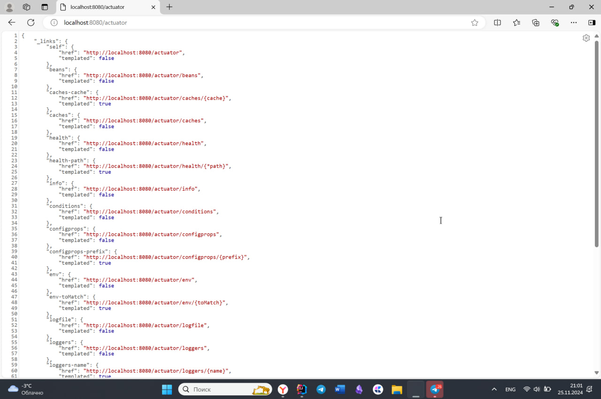
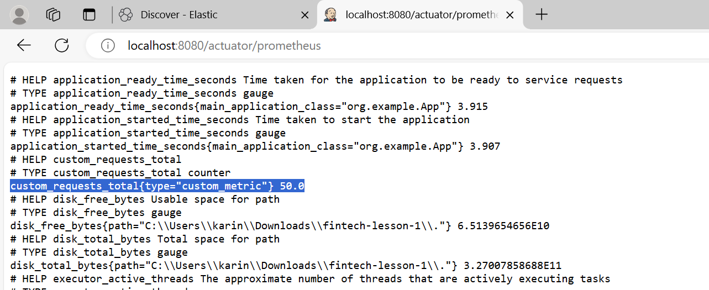
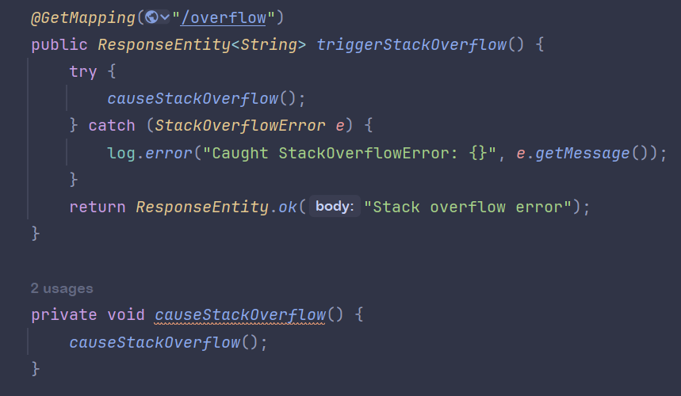
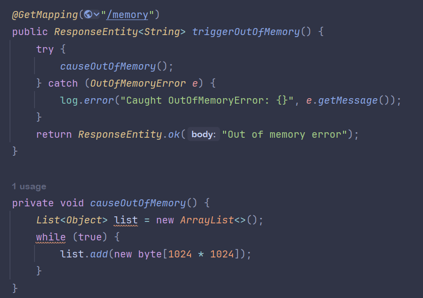

# Lesson 16

## ELK

### Логи Kibana

### Структурные логи в kibana

### График с количеством запросов

## Метрики

### Actuator

### Prometheus

## Работа с памятью

### StackOverflowError

### OutOfMemoryError

